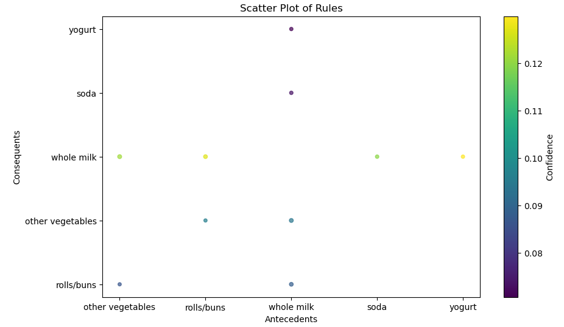

# Market-Basket-Analysis-for-E-commerce
### Project Overview

The goal of this project is to introduce you to the concept of market basket analysis, which is a crucial aspect of data science in retail or e-commerce. You will learn how to extract valuable insights for transaction data, understand customer purchasing behaviour and use this knowledge for business optimization.

### Tools

- Excel
- Data Analysis Tool: Python (using libraries like Pandas, ...)
- Data Visualization Tool: Matplotlib, Seaborn
- Scikit-Learn
- Jupyter Notebook

### Steps 

#### Data Preparation

#### Exploratory Data Analysis (EDA)

#### Market Basket Analysis

#### Visualization

 

 

#### Interpretation and Insights

#### Recommendations

#### Presentation

